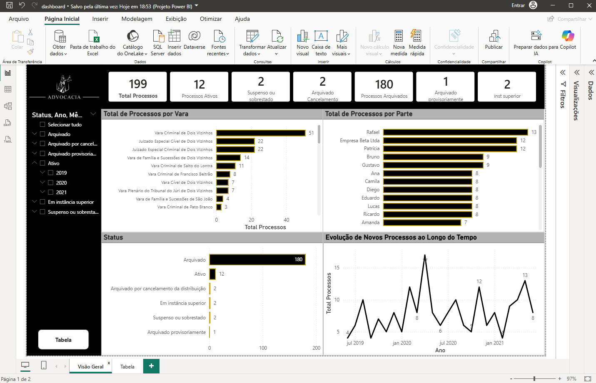
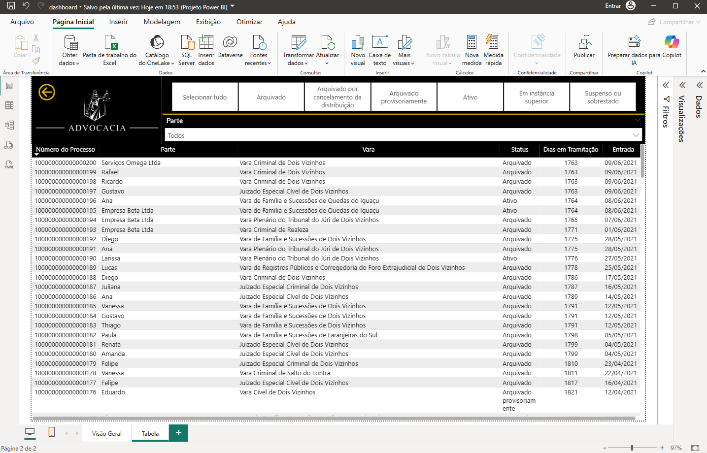

# 📊 Dashboard de Gestão de Processos Judiciais

Este projeto consiste no desenvolvimento de um dashboard interativo em Power BI para análise e gestão de processos judiciais, com foco em acompanhamento operacional, identificação de padrões e apoio à tomada de decisão.

---

## 🎯 Objetivos

- Monitorar o volume de processos
- Identificar processos antigos e possíveis gargalos
- Analisar distribuição por vara
- Avaliar recorrência de partes (clientes/réus)
- Permitir consulta detalhada de processos

---

## 📸 Visão do Projeto

### 🔹 Visão Geral

---

### 🔹 Tabela Operacional

---

## 📈 Principais Indicadores

- Total de processos
- Processos ativos e arquivados
- Dias em tramitação
- Distribuição por status
- Processos por vara
- Evolução temporal dos processos

---

## 🔍 Funcionalidades

- Filtros interativos por:
  - Status
  - Vara
  - Ano
  - Parte
- Busca por nome da parte
- Análise de partes (clientes mais recorrentes)
- Identificação de processos antigos
- Tabela operacional com priorização por tempo

---

## 🧠 Insights Possíveis

- Identificação de processos com maior tempo de tramitação
- Concentração de processos por unidade judicial
- Recorrência de clientes
- Tendências ao longo do tempo

---

## 🛠️ Tecnologias Utilizadas

- Power BI
- Excel
- DAX (Data Analysis Expressions)
- Power Query

---

## 🔐 Observação

Os dados utilizados neste projeto são **fictícios**, criados exclusivamente para fins de demonstração, preservando a privacidade e confidencialidade das informações.

---

## 👨‍💻 Autor

Projeto desenvolvido por **Iago Novaes**